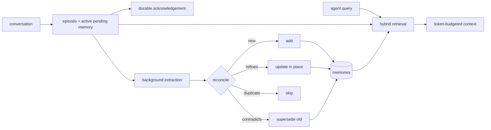

#  Memry

**The open, self-hostable memory layer for AI agents** - [memry.tech](https://memry.tech)

```
pip install memry
memry mcp        # your agent now has long-term memory
```

Memry gives any MCP-capable agent - Claude Code, Claude Desktop, Cursor, Windsurf,
Codex - durable long-term memory. It distills conversations into discrete facts,
reconciles each new fact against what it already knows, and serves the result back as
token-budgeted context. All knowledge state is a single SQLite file on your machine: no external vector
database or queue service, no cloud account, and it works with zero API keys.

## Why Memry

**It runs anywhere, with nothing.** The default install needs no services and no keys:
knowledge storage is one SQLite file, retrieval falls back to FTS5 BM25 plus deterministic hash
embeddings, and writes are stored verbatim. Set `ANTHROPIC_API_KEY` or `OPENAI_API_KEY`
and the same pipeline upgrades itself to LLM extraction and real embeddings. Local-first
is the default, not a demo mode.

**It remembers the way you would want it to.** New facts are reconciled against existing
ones: duplicates are skipped, refinements update in place, and contradictions supersede
the old memory instead of deleting it. Memories are bi-temporal (`valid_from` /
`invalid_at` / `superseded_by`), so "moved to Amsterdam" does not erase "lived in
Berlin" - it dates it. Importance decays with a half-life, and a sweep retires stale
trivia, again without destroying anything.

**Nothing is a black box.** Raw episodes are stored immutably before anything is derived
from them, every memory links back to its source episodes, every mutation is an
inspectable event, and every search hit carries its score signals (BM25, vector,
recency, importance). When a memory looks wrong, you can trace where it came from, or
re-run a better extraction pipeline over the original episodes.

**Entities are disambiguated by evidence.** Mentions become first-class entities. An exact
first-and-last name with overlapping context merges automatically; a shared short name or
full name without supporting context stays separate with a reviewable merge proposal.
Prior merges are followed, so an older proposal cannot leave a broken merge target.

**Topics organize themselves.** Extraction tags each memory at the level a later
conversation would ask about (`liver health`, `weekly gym`, `2026 taxes`), reusing the
vocabulary already in your store rather than coining a synonym every session. Mechanical
variants such as `food`/`foods` merge without review, and Memry also spots tags that have
quietly split one subject. An optional, off-by-default pass groups tags under broader
parents for browsing, stored as hierarchy edges rather than copied onto every memory;
it is off because retrieval measures best at the specific level, not the broad one.
Search and list by topic or by date window.

**It stays simple as one shared service.** SQLite is the sole production store. One Memry
server can serve many agents, devices, and tenant namespaces without an external database.
For larger stores, the optional `memry[ann]` extra adds a rebuildable usearch HNSW
candidate index. Multiple server replicas writing one store are not currently supported.

**Multi-user, with real OAuth.** Beyond static config tenants, one server can host
runtime-managed **accounts**, created with `memry account add`. The first account is the
bootstrap administrator and keeps only the existing default memory space; every later
account gets one private memory space. Set `MEMRY_PUBLIC_URL` and Memry becomes an OAuth 2.1
authorization server for those accounts (dynamic client registration, PKCE, refresh,
revocation, discovery
at the domain root), so any OAuth-capable MCP client - Claude, Cursor, VS Code - can sign in
and get a token scoped to that account. No IdP required; Memry verifies against its own
accounts. Off by default: the single-user path stays keyless. See
[docs/self-hosting.md](docs/self-hosting.md#accounts-and-oauth).

**You can measure it.** A built-in eval harness scores retrieval (recall@k, MRR, latency
percentiles) deterministically and offline. An optional
[Mem0](https://github.com/mem0ai/mem0) adapter lets comparison or import tooling read and
exercise Mem0 under the same interface; it cannot be selected as Memry's runtime store.

## Quickstart

### As an MCP server (any agent)

Memry speaks MCP two ways: **stdio** for agents on the same machine (zero
config, no port, no auth) and **streamable HTTP** for a shared server that
several agents and devices talk to.

**Local, stdio** - the fastest start:

```bash
# Claude Code
claude mcp add memry -- memry mcp
```

```jsonc
// Claude Desktop / Cursor / Windsurf config
{
  "mcpServers": {
    "memry": {
      "command": "memry",
      "args": ["mcp"],
      "env": { "ANTHROPIC_API_KEY": "sk-ant-..." }   // optional but recommended
    }
  }
}
```

**Remote, streamable HTTP** - point any MCP client at a self-hosted server
(see below) and share one memory across every machine:

```bash
# Claude Code
claude mcp add --transport http memry https://memory.example.com/mcp \
  --header "Authorization: Bearer <MEMRY_API_KEY>"
```

```jsonc
// Cursor / Windsurf / anything that takes a config file
{
  "mcpServers": {
    "memry": {
      "type": "http",
      "url": "https://memory.example.com/mcp",
      "headers": { "Authorization": "Bearer <MEMRY_API_KEY>" }
    }
  }
}
```

**claude.ai (web, desktop, mobile)** - add Memry as a custom connector under
Settings → Connectors → Add custom connector. The dialog has no header field,
so embed the key in the URL instead:

```
https://memory.example.com/mcp/<MEMRY_API_KEY>
```

Full walkthrough with screenshots of the flow, security notes, and
troubleshooting: [docs/connect-claude-ai.md](docs/connect-claude-ai.md).

The server exposes `save_memories`, `search_memories`, `get_memory_context`,
`list_memories`, `list_categories`, `update_memory`, `delete_memory`,
`memory_history`, and `memory_stats`. Agents are instructed to recall context
at the start of a task and to batch related durable facts into one concise
multiline `save_memories` call. If related facts arrive in separate calls, the
client can repeat a semantic `context` label and `run_id`; up to three optional
`tags` are treated as classification hints. With the default `infer=true`, the
exact text is acknowledged immediately and remains searchable. The managed
worker waits for two minutes of quiet, then distills each related group when an
LLM is configured.

### As a Python library

```python
from memry import MemoryStore

store = MemoryStore()

# write: extraction + reconciliation (or infer=False to store verbatim)
store.add(
    [{"role": "user", "content": "I'm Ada, a data engineer in Berlin. I prefer uv over pip."}],
    user_id="ada",
)

# read: hybrid search with explainable scores
for hit in store.search("what tooling does the user prefer?", user_id="ada"):
    print(hit.score, hit.memory.content, hit.signals)

# or a ready-to-inject, token-budgeted context block
ctx = store.reconstruct_context("help me set up a new project", user_id="ada", token_budget=1200)
print(ctx.text)
```

### As a self-hosted server (REST + dashboard + MCP)

```bash
memry serve --host 0.0.0.0 --port 8787
# dashboard:  http://localhost:8787/
# REST API:   http://localhost:8787/api/v1/...
# MCP (HTTP): http://localhost:8787/mcp
```

The dashboard shows your memories with inline editing, filtered search, lossless JSON
backup/restore, a unified Knowledge area, and a galaxy map aggregated over every active
memory independently of the paginated detail list. The map groups by tag or entity;
concept and other entity types are hidden by default and the type menu controls what is
shown. Heavily-used groups gravitate to the gold core, the working set orbits in the teal
belt, and one-off groups drift at the violet rim. Orbit-marker shapes distinguish semantic,
procedural, episodic, and working memories. Idle link and orbit rendering is bounded for
large stores; selecting a planet reveals its complete visible neighborhood and filters the
detail list through the server.


With Docker: `docker compose up -d` (see [docker-compose.yml](docker-compose.yml)).

Or on a fresh Ubuntu/Debian VPS, one command installs Docker, Memry, and Caddy with
automatic HTTPS ([full guide](docs/deploy-vps.md)):

```bash
curl -fsSL https://raw.githubusercontent.com/cosmin-novac/memry/main/deploy/install.sh \
  | MEMRY_DOMAIN=memory.example.com bash
```

Set `MEMRY_API_KEY` to require `Authorization: Bearer <key>` on the API. More in
[docs/self-hosting.md](docs/self-hosting.md). To plug a hosted Memry into
claude.ai as a custom connector, see
[docs/connect-claude-ai.md](docs/connect-claude-ai.md).

### Multi-user accounts

One server can host multiple accounts. The first account is the bootstrap administrator and
uses only the existing default memory space. Every later account uses only its own
`name::default` space. The role does not expose other accounts' memories. Manage accounts
on the server with the CLI:

```bash
memry account add alice --password s3cret    # creates it, prints an API key (shown once)
memry account list
memry account issue-key alice --label laptop # another key for the same account
memry account disable alice                   # its keys + sessions stop working immediately
```

An account connects with its API key (`Authorization: Bearer <key>`, or
`https://<host>/mcp/<key>`), or - once you set
`MEMRY_PUBLIC_URL=https://memory.example.com` - by signing in through **OAuth**
from any client that supports it (Claude, ChatGPT, Cursor, VS Code). On the
dashboard, accounts sign in at `/login` with their name and password. Full
walkthrough: [docs/self-hosting.md](docs/self-hosting.md#accounts-and-oauth).

### From the CLI

```bash
memry add "I moved to Amsterdam and joined ASML" -u ada
memry search "where does ada work" -u ada
memry context "plan a commute" -u ada
memry history <memory_id>          # full audit trail
memry sweep                        # decay: soft-forget stale memories
memry eval --dataset evals/datasets/synthetic_v1.jsonl
```

## How it works



1. **Durable acknowledgement.** The MCP fast-save path commits the exact input as an
   immutable episode and active, searchable pending memory before replying. That SQLite
   row is also the recovery marker, so no external queue is required.
2. **Managed enrichment.** One in-process worker drains small database batches. Each
   payload is extracted separately so user scopes, provenance, and retries cannot mix.
   Provider failure leaves the raw memory active and schedules a bounded-backoff retry;
   restart recovery reads the same pending rows. Without an LLM key, they stay verbatim.
3. **Reconciliation.** Each extracted fact is compared to similar active memories:
   duplicates are skipped, refinements rewrite in place, contradictions invalidate the
   old memory and link it to its successor. The pending raw memory is superseded only
   after enrichment succeeds.
4. **Retrieval.** BM25 and cosine similarity are fused with reciprocal-rank fusion, then
   boosted by recency and importance. Pending raw memories are searchable immediately.
5. **Forgetting.** Effective importance decays over time; `memry sweep` invalidates
   memories that fall below threshold. Tag filters (`memry search -c diet`) narrow any
   query.

## Configuration

Everything works with defaults. Override via env vars, `~/.memry/config.json`, or `Config(...)`:

| Env var | Default | Notes |
|---|---|---|
| `MEMRY_DB_PATH` | `~/.memry/memry.db` | knowledge SQLite file; back it up with `auth.db` when accounts are enabled |
| `MEMRY_AUTH_DB_PATH` | next to `MEMRY_DB_PATH` as `auth.db` | accounts and OAuth; include it in every complete server backup |
| `MEMRY_DEFAULT_USER` | `default` | user scope when the agent doesn't pass one |
| `MEMRY_LLM_PROVIDER` | auto | `anthropic` \| `openai` \| `ollama` \| `none` - auto-detected from `OPENAI_API_KEY` / `ANTHROPIC_API_KEY`. With both keys set, OpenAI wins so the LLM and the embeddings stay on one provider (Anthropic has no embeddings API); pin this to override |
| `MEMRY_LLM_MODEL` | per provider | `claude-haiku-4-5` / `gpt-5-mini` / `llama3.1`; Haiku is the Anthropic default for lower save cost and enrichment latency |
| `MEMRY_EMBEDDING_PROVIDER` | auto | `openai` \| `ollama` \| `voyage` \| `hash` \| `none` |
| `MEMRY_API_KEY` | - | bearer token for the REST/MCP HTTP server |

Anthropic extraction requires the optional SDK: `pip install "memry[anthropic]"`.

## Evaluation

```bash
memry eval --dataset evals/datasets/synthetic_v1.jsonl -k 5
```

The harness ingests each case through the full write path, then scores retrieval
(recall@k, MRR, latency p50/p95). It is deterministic and offline, so it runs in CI.
LoCoMo and LongMemEval can be formatted into the same JSONL schema to compare providers,
configs, plus the optional Mem0 comparison adapter, under identical conditions. The
landscape survey behind the design is in
[docs/research/competitive-analysis.md](docs/research/competitive-analysis.md).

## Project layout

```
src/memry/
  models.py            # Episode / Memory / MemoryEvent (bi-temporal, provenance)
  config.py            # env + file config, provider auto-detection
  store.py             # MemoryStore - the public API
  enrichment.py        # managed pending-memory worker and restart recovery
  retrieval.py         # hybrid search: RRF + recency + importance
  backends/            # storage contract + the production SQLite engine
  intelligence/        # extraction, reconciliation, decay, context building
  providers/           # LLMs (Anthropic/OpenAI/Ollama) & embeddings (+hash fallback)
  mcp_server.py        # MCP tools (stdio + streamable HTTP)
  rest.py              # REST API + dashboard + /mcp mount
  evals/               # retrieval eval harness; supports explicit comparison adapters
```

## Development

```bash
pip install -e ".[dev]"
pytest
```

## License

[Apache-2.0](LICENSE)
