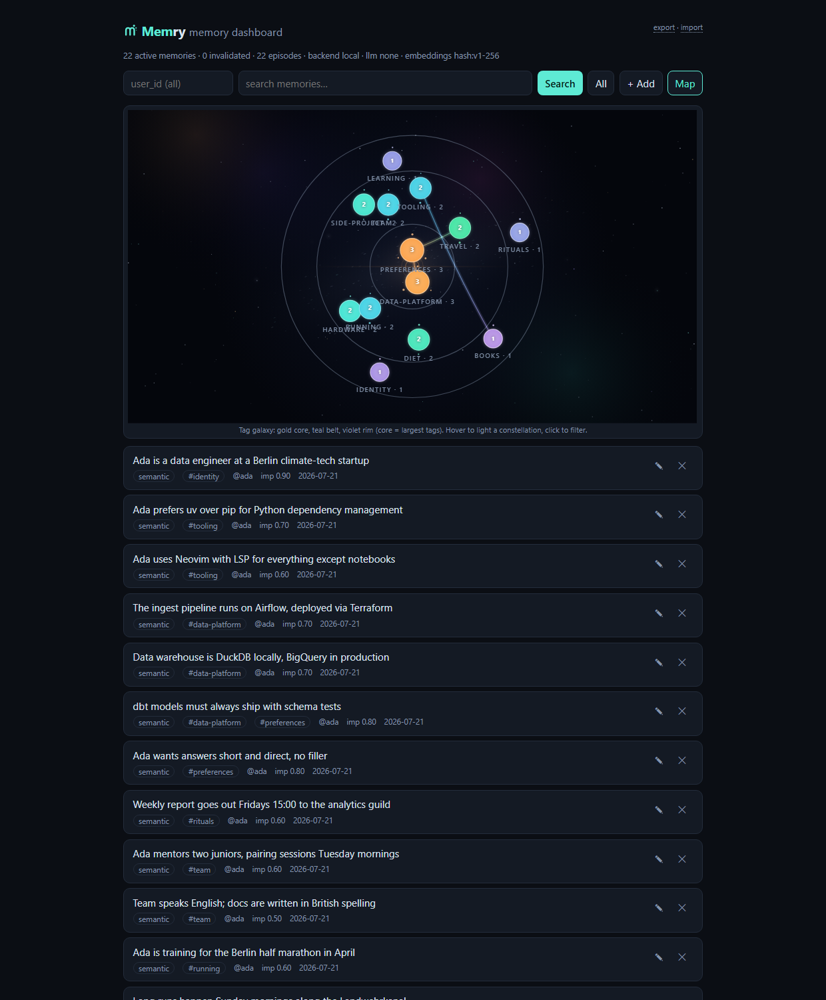
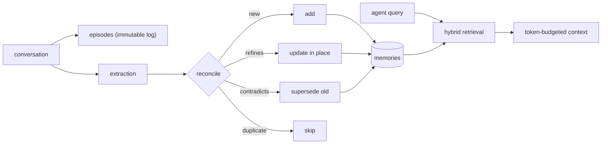

#  Memry

**The open, self-hostable memory layer for AI agents** - [memry.tech](https://memry.tech)

```
pip install memry
memry mcp        # your agent now has long-term memory
```

Memry gives any MCP-capable agent - Claude Code, Claude Desktop, Cursor, Windsurf,
Codex - durable long-term memory. It distills conversations into discrete facts,
reconciles each new fact against what it already knows, and serves the result back as
token-budgeted context. All state is a single SQLite file on your machine: no vector
database, no queue, no cloud account, and it works with zero API keys.

## Why Memry

**It runs anywhere, with nothing.** The default install needs no services and no keys:
storage is one SQLite file, retrieval falls back to FTS5 BM25 plus deterministic hash
embeddings, and writes are stored verbatim. Set `ANTHROPIC_API_KEY` or `OPENAI_API_KEY`
and the same pipeline upgrades itself to LLM extraction and real embeddings. Local-first
is the default, not a demo mode.

**It remembers the way you would want it to.** New facts are reconciled against existing
ones: duplicates are skipped, refinements update in place, and contradictions supersede
the old memory instead of deleting it. Memories are bi-temporal (`valid_from` /
`invalid_at` / `superseded_by`), so "moved to Amsterdam" does not erase "lived in
Berlin" - it dates it. Importance decays with a half-life, and a sweep retires stale
trivia, again without destroying anything.

**Nothing is a black box.** Raw episodes are stored immutably before anything is derived
from them, every memory links back to its source episodes, every mutation is an
inspectable event, and every search hit carries its score signals (BM25, vector,
recency, importance). When a memory looks wrong, you can trace where it came from, or
re-run a better extraction pipeline over the original episodes.

**Entities are disambiguated, not name-matched.** Mentions become first-class entities,
and a shared name is never enough to merge two of them: unclear cases stay separate
("three Jonases") with a merge proposal you confirm or reject once the evidence is in.

**It scales when needed and stays simple when not.** Optional extras add a usearch HNSW
index for larger stores (`memry[ann]`) and a PostgreSQL + pgvector backend for
multi-writer deployments (`memry[postgres]`). Per-tenant API keys with strict isolation
(`MEMRY_TENANTS`) let one server serve several teams. The default remains a zero-ops
single file.

**Multi-user, with real OAuth.** Beyond static config tenants, one server can host
runtime-managed **accounts**, each confined to its own namespace, created with
`memry account add`. Set `MEMRY_PUBLIC_URL` and Memry becomes an OAuth 2.1 authorization
server for those accounts (dynamic client registration, PKCE, refresh, revocation, discovery
at the domain root), so any OAuth-capable MCP client - Claude, Cursor, VS Code - can sign in
and get a token scoped to that account. No IdP required; Memry verifies against its own
accounts. Off by default: the single-user path stays keyless. See
[docs/self-hosting.md](docs/self-hosting.md#accounts-and-oauth).

**You can measure it.** A built-in eval harness scores retrieval (recall@k, MRR, latency
percentiles) deterministically and offline, and the pluggable backend interface includes
a [Mem0](https://github.com/mem0ai/mem0) adapter so you can benchmark against it under
identical conditions.

## Quickstart

### As an MCP server (any agent)

Memry speaks MCP two ways: **stdio** for agents on the same machine (zero
config, no port, no auth) and **streamable HTTP** for a shared server that
several agents and devices talk to.

**Local, stdio** - the fastest start:

```bash
# Claude Code
claude mcp add memry -- memry mcp
```

```jsonc
// Claude Desktop / Cursor / Windsurf config
{
  "mcpServers": {
    "memry": {
      "command": "memry",
      "args": ["mcp"],
      "env": { "ANTHROPIC_API_KEY": "sk-ant-..." }   // optional but recommended
    }
  }
}
```

**Remote, streamable HTTP** - point any MCP client at a self-hosted server
(see below) and share one memory across every machine:

```bash
# Claude Code
claude mcp add --transport http memry https://memory.example.com/mcp \
  --header "Authorization: Bearer <MEMRY_API_KEY>"
```

```jsonc
// Cursor / Windsurf / anything that takes a config file
{
  "mcpServers": {
    "memry": {
      "type": "http",
      "url": "https://memory.example.com/mcp",
      "headers": { "Authorization": "Bearer <MEMRY_API_KEY>" }
    }
  }
}
```

**claude.ai (web, desktop, mobile)** - add Memry as a custom connector under
Settings → Connectors → Add custom connector. The dialog has no header field,
so embed the key in the URL instead:

```
https://memory.example.com/mcp/<MEMRY_API_KEY>
```

Full walkthrough with screenshots of the flow, security notes, and
troubleshooting: [docs/connect-claude-ai.md](docs/connect-claude-ai.md).

The server exposes `save_memories`, `search_memories`, `get_memory_context`,
`list_memories`, `list_categories`, `update_memory`, `delete_memory`,
`memory_history`, and `memory_stats`. Agents are instructed to recall context
at the start of a task, save durable facts as they appear, and check the
`warnings` field on saves (it reports anything distillation dropped).

### As a Python library

```python
from memry import MemoryStore

store = MemoryStore()

# write: extraction + reconciliation (or infer=False to store verbatim)
store.add(
    [{"role": "user", "content": "I'm Ada, a data engineer in Berlin. I prefer uv over pip."}],
    user_id="ada",
)

# read: hybrid search with explainable scores
for hit in store.search("what tooling does the user prefer?", user_id="ada"):
    print(hit.score, hit.memory.content, hit.signals)

# or a ready-to-inject, token-budgeted context block
ctx = store.reconstruct_context("help me set up a new project", user_id="ada", token_budget=1200)
print(ctx.text)
```

### As a self-hosted server (REST + dashboard + MCP)

```bash
memry serve --host 0.0.0.0 --port 8787
# dashboard:  http://localhost:8787/
# REST API:   http://localhost:8787/api/v1/...
# MCP (HTTP): http://localhost:8787/mcp
```

The dashboard shows your memories with inline editing, search, JSONL
export/import, and a galaxy map of your tags: heavily-used tags gravitate to
the gold core, the working set orbits in the teal belt, and one-off tags
drift at the violet rim. Links are co-occurrence; click a planet to filter.



With Docker: `docker compose up -d` (see [docker-compose.yml](docker-compose.yml)).

Or on a fresh Ubuntu/Debian VPS, one command installs Docker, Memry, and Caddy with
automatic HTTPS ([full guide](docs/deploy-vps.md)):

```bash
curl -fsSL https://raw.githubusercontent.com/cosmin-novac/memry/main/deploy/install.sh \
  | MEMRY_DOMAIN=memory.example.com bash
```

Set `MEMRY_API_KEY` to require `Authorization: Bearer <key>` on the API. More in
[docs/self-hosting.md](docs/self-hosting.md). To plug a hosted Memry into
claude.ai as a custom connector, see
[docs/connect-claude-ai.md](docs/connect-claude-ai.md).

### Multi-user accounts

One server can host isolated accounts, each confined to its own `name::*`
namespace. Manage them with the CLI:

```bash
memry account add alice --password s3cret    # creates it, prints an API key (shown once)
memry account list
memry account issue-key alice --label laptop # another key for the same account
memry account disable alice                   # its keys + sessions stop working immediately
```

An account connects with its API key (`Authorization: Bearer <key>`, or
`https://<host>/mcp/<key>`), or - once you set
`MEMRY_PUBLIC_URL=https://memory.example.com` - by signing in through **OAuth**
from any client that supports it (Claude, ChatGPT, Cursor, VS Code). On the
dashboard, accounts sign in at `/login` with their name and password. Full
walkthrough: [docs/self-hosting.md](docs/self-hosting.md#accounts-and-oauth).

### From the CLI

```bash
memry add "I moved to Amsterdam and joined ASML" -u ada
memry search "where does ada work" -u ada
memry context "plan a commute" -u ada
memry history <memory_id>          # full audit trail
memry sweep                        # decay: soft-forget stale memories
memry eval --dataset evals/datasets/synthetic_v1.jsonl
```

## How it works



1. **Episodes first.** Every message is stored verbatim before anything is derived from
   it. Memories are an index; episodes are the source of truth.
2. **Extraction.** An LLM distills discrete, self-contained facts with a type
   (semantic / episodic / procedural), importance, categories, and entities. Without an
   LLM key, messages are stored verbatim and everything still works.
3. **Reconciliation.** Each fact is compared to its most similar existing memories:
   duplicates are skipped, refinements rewrite in place, contradictions invalidate the
   old memory and link it to its successor.
4. **Retrieval.** BM25 and cosine similarity fused with reciprocal-rank fusion, then
   boosted by recency and importance. Keyword-only when no embedder is configured.
5. **Forgetting.** Effective importance decays over time; `memry sweep` invalidates
   memories that fall below threshold. Category filters (`memry search -c diet`) narrow
   any query.

## Configuration

Everything works with defaults. Override via env vars, `~/.memry/config.json`, or `Config(...)`:

| Env var | Default | Notes |
|---|---|---|
| `MEMRY_DB_PATH` | `~/.memry/memry.db` | single SQLite file |
| `MEMRY_BACKEND` | `local` | `local` \| `mem0` (needs `memry[mem0]`) |
| `MEMRY_DEFAULT_USER` | `default` | user scope when the agent doesn't pass one |
| `MEMRY_LLM_PROVIDER` | auto | `anthropic` \| `openai` \| `ollama` \| `none` - auto-detected from `ANTHROPIC_API_KEY` / `OPENAI_API_KEY` |
| `MEMRY_LLM_MODEL` | per provider | `claude-opus-4-8` / `gpt-5-mini` / `llama3.1` (use `claude-haiku-4-5` for cheaper extraction) |
| `MEMRY_EMBEDDING_PROVIDER` | auto | `openai` \| `ollama` \| `voyage` \| `hash` \| `none` |
| `MEMRY_API_KEY` | - | bearer token for the REST/MCP HTTP server |

Anthropic extraction requires the optional SDK: `pip install "memry[anthropic]"`.

## Evaluation

```bash
memry eval --dataset evals/datasets/synthetic_v1.jsonl -k 5
```

The harness ingests each case through the full write path, then scores retrieval
(recall@k, MRR, latency p50/p95). It is deterministic and offline, so it runs in CI.
LoCoMo and LongMemEval can be formatted into the same JSONL schema to compare providers,
configs, and backends (including the Mem0 adapter) under identical conditions. The
landscape survey behind the design is in
[docs/research/competitive-analysis.md](docs/research/competitive-analysis.md).

## Project layout

```
src/memry/
  models.py            # Episode / Memory / MemoryEvent (bi-temporal, provenance)
  config.py            # env + file config, provider auto-detection
  store.py             # MemoryStore - the public API
  retrieval.py         # hybrid search: RRF + recency + importance
  backends/            # storage interface, local SQLite engine, Mem0 adapter
  intelligence/        # extraction, reconciliation, decay, context building
  providers/           # LLMs (Anthropic/OpenAI/Ollama) & embeddings (+hash fallback)
  mcp_server.py        # MCP tools (stdio + streamable HTTP)
  rest.py              # REST API + dashboard + /mcp mount
  evals/               # retrieval eval harness
```

## Development

```bash
pip install -e ".[dev]"
pytest
```

## License

[Apache-2.0](LICENSE)
