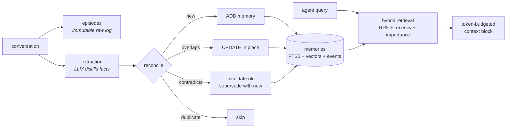

# Memry

**[memry.tech](https://memry.tech)** - the open, self-hostable memory layer for AI agents. One `pip install`, zero services,
plugged into any agent over MCP - with the intelligence layer (extraction, reconciliation,
temporal invalidation, decay, context construction) as first-class, replaceable research code.

```
pip install memry
memry mcp          # ← your agent now has long-term memory
```

- **MCP-native** - works with Claude Code, Claude Desktop, Cursor, Windsurf, Codex, and any
  other MCP client, over stdio or streamable HTTP.
- **Local-first** - a single SQLite file. No vector DB, no Postgres, no cloud. Works with
  **zero API keys** (FTS5 BM25 + deterministic hash embeddings), gets smarter the moment you
  set `ANTHROPIC_API_KEY` / `OPENAI_API_KEY`.
- **Real memory, not a vector dump** - LLM extraction distills conversations into discrete
  facts; reconciliation deduplicates, merges, and **supersedes contradicted memories instead
  of deleting them** (bi-temporal: `valid_from` / `invalid_at` / `superseded_by`).
- **Explainable retrieval** - hybrid vector + BM25 with reciprocal-rank fusion, boosted by
  recency and importance; every result carries its score signals.
- **Provenance & audit** - raw episodes are stored immutably; every memory links to its
  source episodes; every mutation is an event you can inspect (`history`).
- **Forgetting built in** - importance decays with a half-life; a decay sweep soft-forgets
  stale trivia (invalidated, never destroyed).
- **Entities, disambiguated** - mentions become first-class entities, and a name match is
  never enough to merge: unclear cases stay separate ("three Jonases") with a merge
  proposal you (or the system, once evidence is clear) confirm or reject later.
- **Category filters** - `search(categories=["diet"])`, `memry search -c diet`,
  `?categories=` on REST, `categories` on the MCP search tool.
- **Scales when you need it** - optional usearch HNSW index (`memry[ann]`) for vector
  search at scale, and a PostgreSQL + pgvector backend (`memry[postgres]`) for
  multi-writer deployments. SQLite stays the zero-ops default.
- **Multi-tenant ready** - per-tenant API keys with transparent namespacing and strict
  isolation on the self-hosted server (`MEMRY_TENANTS`), plus an admin key.
- **Research-grade** - a built-in eval harness (recall@k, MRR, latency) with a synthetic
  dataset, plus a pluggable backend interface with an optional [Mem0](https://github.com/mem0ai/mem0)
  adapter so you can benchmark against it under identical conditions.

Apache-2.0. Your agents. Your memories. Your infrastructure.

---

## Quickstart

### 1. As an MCP server (any agent)

```jsonc
// Claude Desktop / Cursor / Windsurf config
{
  "mcpServers": {
    "memry": {
      "command": "memry",
      "args": ["mcp"],
      "env": { "ANTHROPIC_API_KEY": "sk-ant-..." }   // optional but recommended
    }
  }
}
```

```bash
# Claude Code
claude mcp add memry -- memry mcp
```

The server exposes: `save_memories`, `search_memories`, `get_memory_context`,
`list_memories`, `update_memory`, `delete_memory`, `memory_history`, `memory_stats`.

### 2. As a Python library

```python
from memry import MemoryStore

store = MemoryStore()

# write: extraction + reconciliation (or infer=False to store verbatim)
store.add(
    [{"role": "user", "content": "I'm Ada, a data engineer in Berlin. I prefer uv over pip."}],
    user_id="ada",
)

# read: hybrid search with explainable scores
for hit in store.search("what tooling does the user prefer?", user_id="ada"):
    print(hit.score, hit.memory.content, hit.signals)

# or a ready-to-inject, token-budgeted context block
ctx = store.reconstruct_context("help me set up a new project", user_id="ada", token_budget=1200)
print(ctx.text)
```

### 3. Self-hosted server (REST + dashboard + MCP)

```bash
memry serve --host 0.0.0.0 --port 8787
# dashboard:  http://localhost:8787/
# REST API:   http://localhost:8787/api/v1/...
# MCP (HTTP): http://localhost:8787/mcp
```

Or with Docker:

```bash
docker compose up -d      # see docker-compose.yml
```

Or on a fresh VPS (Ubuntu/Debian) with automatic HTTPS - one command, any
provider ([guide](docs/deploy-vps.md)):

```bash
curl -fsSL https://raw.githubusercontent.com/cosmin-novac/memry/main/deploy/install.sh \
  | MEMRY_DOMAIN=memory.example.com bash
```

Set `MEMRY_API_KEY` to require `Authorization: Bearer <key>` on the API.

### 4. CLI

```bash
memry add "I moved to Amsterdam and joined ASML" -u ada
memry search "where does ada work" -u ada
memry context "plan a commute" -u ada
memry history <memory_id>          # full audit trail
memry sweep                        # decay: soft-forget stale memories
memry eval --dataset evals/datasets/synthetic_v1.jsonl
```

---

## How it works



1. **Episodes first.** Every message is stored verbatim before anything is derived from it.
   Memories are an index; episodes are the source of truth - you can re-run a better
   extraction pipeline over them later.
2. **Extraction** (Mem0-style phase 1): an LLM distills discrete, self-contained facts with
   type (semantic / episodic / procedural), importance, categories, and entities. Without an
   LLM, messages are stored verbatim so the system still works.
3. **Reconciliation** (phase 2, with Zep-style temporal semantics): each fact is compared to
   its most similar existing memories - duplicates are skipped, refinements rewrite in place,
   and contradictions *invalidate* the old memory and link it to its successor.
4. **Retrieval**: BM25 + cosine similarity fused with RRF, then boosted by recency
   (half-life) and importance. Keyword-only when no embedder is configured.
5. **Forgetting**: effective importance decays over time; `memry sweep` invalidates
   memories that decayed below threshold.

## Configuration

Everything works with defaults. Override via env vars, `~/.memry/config.json`, or `Config(...)`:

| Env var | Default | Notes |
|---|---|---|
| `MEMRY_DB_PATH` | `~/.memry/memry.db` | single SQLite file |
| `MEMRY_BACKEND` | `local` | `local` \| `mem0` (needs `memry[mem0]`) |
| `MEMRY_DEFAULT_USER` | `default` | user scope when the agent doesn't pass one |
| `MEMRY_LLM_PROVIDER` | auto | `anthropic` \| `openai` \| `ollama` \| `none` - auto-detected from `ANTHROPIC_API_KEY` / `OPENAI_API_KEY` |
| `MEMRY_LLM_MODEL` | per provider | `claude-opus-4-8` / `gpt-5-mini` / `llama3.1` (use `claude-haiku-4-5` for a cheaper extraction model) |
| `MEMRY_EMBEDDING_PROVIDER` | auto | `openai` \| `ollama` \| `voyage` \| `hash` \| `none` |
| `MEMRY_API_KEY` | - | bearer token for the REST/MCP HTTP server |

Anthropic extraction requires the optional SDK: `pip install "memry[anthropic]"`.

## Evaluation

```bash
memry eval --dataset evals/datasets/synthetic_v1.jsonl -k 5
```

The harness ingests each case through the full write path, then scores retrieval
(recall@k, MRR, latency p50/p95) - deterministic and offline, so it runs in CI. Format
LoCoMo/LongMemEval into the same JSONL schema to compare providers, configs, and backends
(including the Mem0 adapter) under identical conditions. See
[docs/research/competitive-analysis.md](docs/research/competitive-analysis.md) for the
landscape survey behind the design.

## Project layout

```
src/memry/
  models.py            # Episode / Memory / MemoryEvent (bi-temporal, provenance)
  config.py            # env + file config, provider auto-detection
  store.py             # MemoryStore - the public API
  retrieval.py         # hybrid search: RRF + recency + importance
  backends/            # storage interface, local SQLite engine, Mem0 adapter
  intelligence/        # extraction, reconciliation, decay, context building
  providers/           # LLMs (Anthropic/OpenAI/Ollama) & embeddings (+hash fallback)
  mcp_server.py        # MCP tools (stdio + streamable HTTP)
  rest.py              # REST API + dashboard + /mcp mount
  evals/               # retrieval eval harness
```

## Development

```bash
pip install -e ".[dev]"
pytest
```

## License

[Apache-2.0](LICENSE)
